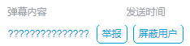
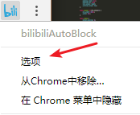
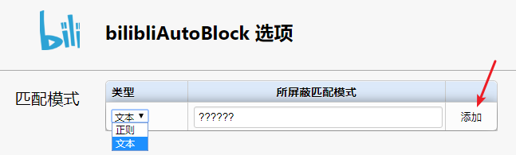
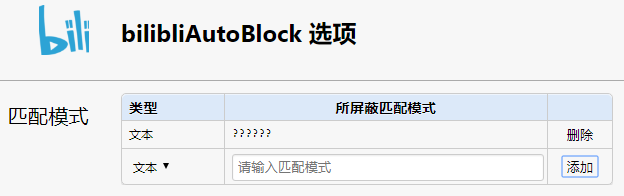
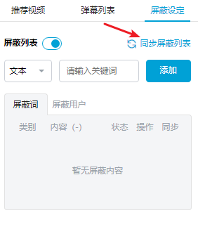
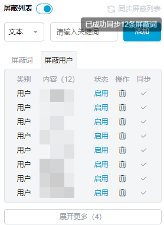
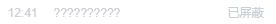

# bilibiliAutoBlock
基于弹幕内容的用户自动屏蔽Chrome扩展。

### 使用方法

**以下为假设的应用场景，并无任何倾向，仅用于功能演示：**

**`??????`的选取仅因看到一视频中相关弹幕较多方便用于演示，无他意。**

假设你看到如下一连串的问号决定屏蔽该用户，你可以使用bilibiliAutoBlock实现自动屏蔽。

1. 进入选项进行屏蔽模式的设置：

   

   你决定屏蔽掉发送弹幕中含有`??????`的用户，在类型中选取文本，输入模式进行添加：

   

   完成后如下图所示：

   

2. 接下来你在正常使用b站的同时便可以实现对于满足该条件用户的自动屏蔽，bilibiliAutoBlock会自动利用所登陆bilibili账号进行云端屏蔽，你只需在适当的时候进行列表的同步即可，如下：

   

   点击“同步屏蔽列表”后结果如下：

   

   若当前视频弹幕中存在含有`??????`的弹幕，可以看到已经对于该用户进行了屏蔽：

   

**使用正则进行更精准的匹配。**
